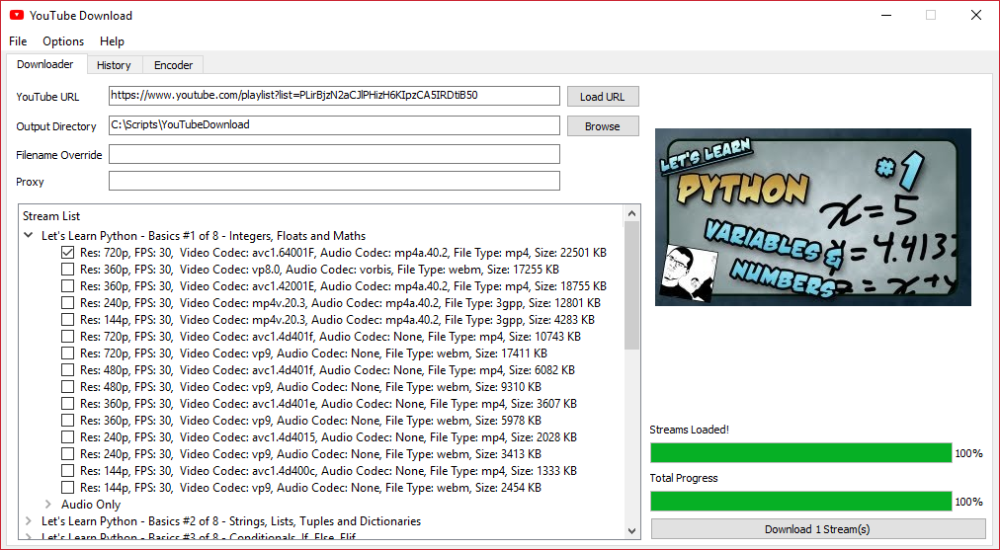

# YouTube Download
A simple application written in Python3 to download YouTube videos.
These videos can also be downloaded as audio.




### Download Pre-Built Binaries
Unless you are wanting to use the CLI or do something with the
scripts themselves, you are most likely looking for the binaries.
* [Download Windows](https://github.com/YouTubeDownload/YouTubeDownload/releases/download/v2.0/YouTube.Download.exe)
* [Download Linux](https://github.com/YouTubeDownload/YouTubeDownload/releases/download/v2.0/YouTubeDownload-linux)
* Download Mac (Need someone to build)

### Scripts Installation
1. Clone the Repo
```Bash
cd YouTubeDownload
# run pipenv shell
pipenv shell
# Then install the dependencies
pipenv install
# To Run the script 
python3 script.py
```

### Usage

You can either run the GUI (`qt_gui.py`), the script (`script.py`) directly for interactive mode,
or use the command line arguments on the script (`script.py`).

    python3 qt_gui.py
    python3 script.py
    python3 script.py -u rfscVS0vtbw -l
    python3 script.py -u rfscVS0vtbw -o videos/ -f my_downloaded_video
    python3 script.py -u rfscVS0vtbw -i 278 -o videos/ -f my_downloaded_itag_video
    python3 script.py -u rfscVS0vtbw -o audio/ -f my_downloaded_audio --audio-only
    python3 script.py --help
    
    -u --url            YouTube URL or YouTube Video ID to download
    -l --list-streams   List available streams for this YouTube Video 
                        instead of download. Use -a/--audio-only to list audio streams.
                        Download specific stream with the 
                        itag ID and -i/--itag argument.
    -i --itag           Stream ITAG to download for given YouTube Video/ID.
                        List streams with -l/--list-streams argument.
                        If ITAG is not provided, default stream will be downloaded.
                        Downloading with ITAG ignores -a/--audio-only.
    -o --output-path    Output Directory Path
    -f --filename       Override the output filename. Does not override file extension
    -p --proxy          Proxy to use. Ex http://xxx.xxx.xxx:8080. NOTE: You need https proxy for https URL!
    -a --audio-only     Download Audio Only
    

**NOTE:** If you are using a proxy, you need https proxy for https URL!

Here's the demo on how to use it

<div align="center">
  <a href="https://vimeo.com/281200561"></a><br>
</div>

### Building Binaries

If you want to build binaries, make sure you have pywin32 installed (Windows only),
as well as pyinstaller. Then run the following command from the script directory.

    pyinstaller --clean --onefile pyinstaller.spec
    
The binary will be put into the `dist` directory within the script directory.
    
### Contributing

If you would like to suggest changes feel free to fork this repo and create PR or submit an issue


Join Our Slack Chat
[Slack](https://join.slack.com/t/youtubedownload/shared_invite/enQtNDE4MDczNzI3MzgyLTk4ZjljNjVjZDQ2NzFlZDdhM2EwMzY2MjIzMjVkM2MzMzc0OTZmMjM4NWQ5ODNjODEwNzhiNTM3YjFiYzczMzc)
